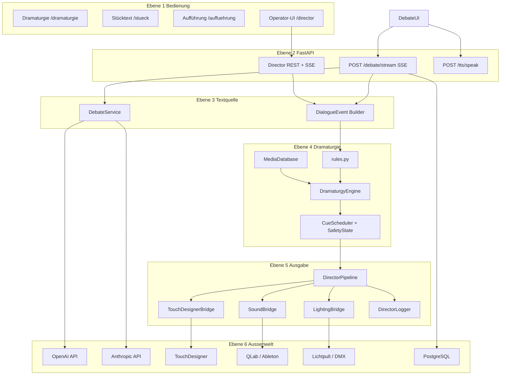
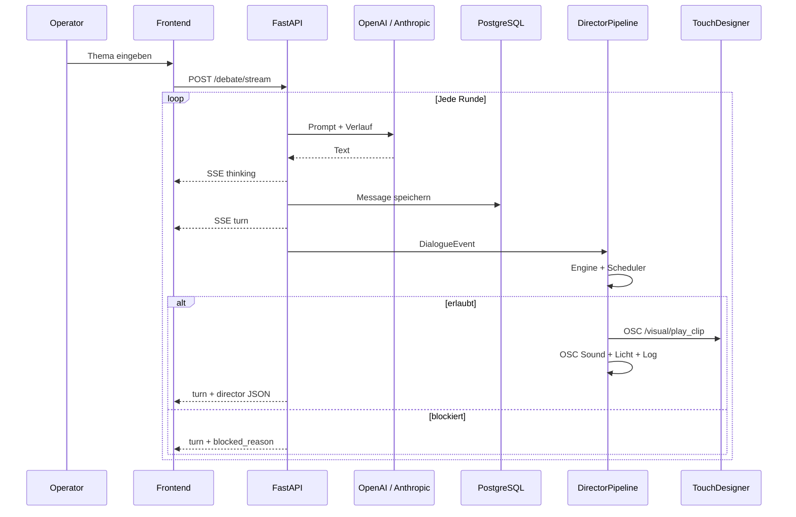
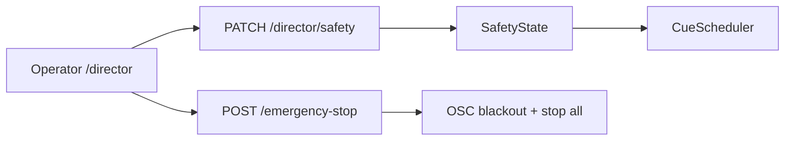
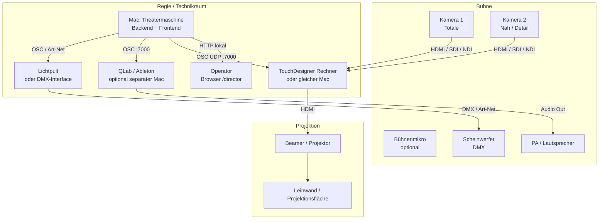
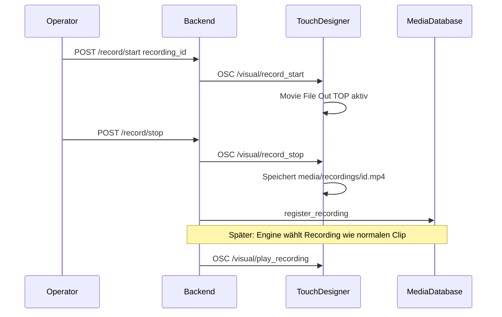

# Theatermaschine — Architektur & Bühnen-Setup

Übersicht über Software-Schichten, Signale und den physischen Aufbau (Kamera, Ton, Licht).

Weitere Details: [PLAN.md](../PLAN.md) · [TouchDesigner-Setup](../touchdesigner/README_touchdesigner_setup.md) · [README](../README.md)

---

## 1. Software-Schichten — was baut auf was auf?



**Kernprinzip:**

```text
DialogueEvent  →  DramaturgyDecision  →  ScheduledCue  →  OSC / Log
   dramaturgisch      abstrakte Cues         technisch
```

---

## 2. Signale — Eingang, Verarbeitung, Ausgang

### 2.1 Hauptpfad (Debatte → Regie)



### 2.2 Signal-Typen

| Stufe | Signal | Beispiel |
|-------|--------|----------|
| **Rein** | `DebateRequest` | `topic`, `rounds`, Modelle |
| **Rein** | KI-Antwort | Fließtext |
| **Intern** | `DialogueEvent` | `speaker`, `text`, `mood`, `intensity`, `tags` |
| **Intern** | `DramaturgyDecision` | `visual`, `sound`, `light`, `reason` |
| **Raus SSE** | `turn` + `director` | Text + Regieentscheidung |
| **Raus OSC Video** | `/visual/play_clip` | `clip_id`, `opacity`, `fade_time` |
| **Raus OSC Sound** | `/sound/trigger` | `cue_id`, `volume` |
| **Raus OSC Licht** | `/light/set_scene` | `scene_id`, `fade_time` |
| **Raus Log** | `logs/director.log` | JSON pro Entscheidung |

### 2.3 Operator-Eingriffe (parallel)



| Flag | Wirkung |
|------|---------|
| `autopilot_enabled` | Regie führt Cues aus oder nur Vorschlag |
| `visuals_enabled` | Video/OSC an TD |
| `sound_enabled` | Sound-Cues |
| `lights_enabled` | Licht-Cues |
| `blackout_locked` | Verhindert Blackout-Cues |
| `emergency_stop_active` | Alles aus |

---

## 3. Physisches Bühnen-Setup

### 3.1 Gesamtübersicht (empfohlene Anordnung)



### 3.2 Rollen der Geräte

| Gerät | Aufgabe | Anbindung an Theatermaschine |
|-------|---------|------------------------------|
| **Mac (Orchestrator)** | KI-Debatte, Dramaturgie, OSC senden | `backend/.env`, Docker oder nativ |
| **TouchDesigner** | Video: Clips, Live-Kamera, Effekte, Aufnahme | OSC Empfang Port 7000 |
| **Beamer** | Bild für Publikum | HDMI von TD-Out-TOP |
| **Kamera(n)** | Livebild für Aufnahme & Projektion | Capture in TD (Video Device In / NDI) |
| **QLab / Ableton** | Theater-Sound, Cues, Fades | OSC `/sound/*` |
| **Lichtpult / Interface** | DMX-Scenen | OSC → Pult, oder Art-Net (Phase 3) |
| **Operator-Laptop** | Overrides, Emergency Stop | Browser → `/director` |

---

## 4. Video & Kameras

### 4.1 Was TouchDesigner macht

```text
OSC In (Port 7000)
    ↓
Media Router (clip_id → Movie File In TOP)
    +
Video Device In TOP / NDI In  ← Live-Kameras
    ↓
Switch TOP / Cross TOP / Composite TOP
    ↓
Level TOP (Opacity, Fade)
    ↓
Out TOP → Beamer
    ↓
Movie File Out TOP → media/recordings/  (bei record_start/stop)
```

### 4.2 Kamera-Setup (empfohlen)

| Variante | Kameras | Einsatz | Anbindung |
|----------|---------|---------|-----------|
| **MVP** | keine | Nur vorbereitete Clips aus `media/video/` | — |
| **Standard** | 1× USB/HDMI | Livebild + Aufnahme für spätere Wiederverwendung | Video Device In TOP |
| **Erweitert** | 2× | Totale + Nahaufnahme (z. B. Körper-Themen) | Switch TOP wählt Eingang |
| **Profi** | SDI/NDI | Flexible Positionierung, lange Kabelwege | Blackmagic / NDI In |

**Dramaturgie-Bezug:** Tags wie `body`, `körper` → Nahkamera; `memory`, `archive` → Archiv-Clips oder aufgezeichnetes Material.

### 4.3 Aufnahme & Wiedergabe (Phase 4)



---

## 5. Ton

### 5.1 Signalweg

```text
DramaturgyDecision.sound
    ↓
SoundBridge (Python)
    ↓
OSC /sound/trigger  cue_id  volume
OSC /sound/stop     cue_id
OSC /sound/volume   cue_id  volume
    ↓
QLab / Ableton (empfohlen für Theater)
    ↓
PA → Lautsprecher
```

### 5.2 Aufbau (empfohlen)

| Komponente | Empfehlung | Hinweis |
|------------|------------|---------|
| **Software** | QLab (Mac) oder Ableton Live | QLab ist Standard im Theater |
| **Audio-Interface** | 2+ Ausgänge (Stereo oder Mehrkanal) | Getrennt von TD-Audio |
| **Lautsprecher** | PA oder aktive Monitore | Drone/Ambient leise starten |
| **KI-Stimmen (TTS)** | Frontend `/tts/speak` | Separater Kanal — nicht über QLab, oder als eigener QLab-Cue |
| **Katalog** | `data/media.json` → `sounds` | `cue_id` muss in QLab/Ableton existieren |

### 5.3 QLab-Anbindung (Beispiel)

1. QLab OSC aktivieren (Einstellungen → OSC).
2. Cue-Nummern oder Cue-Namen = `cue_id` aus `media.json` (z. B. `low_drone_02`).
3. Python sendet: `/sound/trigger low_drone_02 0.6`
4. In QLab: OSC-Trigger auf passenden Audio-Cue mappen.

**MVP ohne QLab:** `OSC_DRY_RUN=true` — Sound-Entscheidungen nur in `logs/director.log`.

---

## 6. Licht

### 6.1 Signalweg

```text
DramaturgyDecision.light
    ↓
LightingBridge (Python)
    ↓
OSC /light/set_scene  scene_id  fade_time
OSC /light/blackout
    ↓
Option A: Lichtsoftware (z. B. über TD weiterleiten)
Option B: Art-Net / sACN → DMX-Interface → Scheinwerfer
Option C: MIDI/MSC → bestehendes Lichtpult
```

DMX-Werte pro Szene: [`data/light_scenes.json`](../data/light_scenes.json)

### 6.2 Aufbau (empfohlen)

| Phase | Setup | Steuerung |
|-------|-------|-----------|
| **MVP** | Kein echtes Licht | Nur Log + OSC dry-run |
| **Test** | 1–4 DMX-Kanäle, LED-Par | USB-DMX-Interface, Szenen in JSON |
| **Aufführung** | Volles Pult oder Art-Net-Netzwerk | Szenen am Pult vorprogrammiert, IDs = `scene_id` |

### 6.3 Typische Lichtpositionen

```text
Kanal 1–3: RGB Frontlicht
Kanal 4:    Dimmer / Strobe
```

Beispiel-Szene `cold_blue_low`: wenig Rot, mittel Grün, viel Blau — seitliches kühles Licht.

**Sicherheit:** `blackout_locked=true` standardmäßig — Blackout nur wenn Operator es erlaubt. **Emergency Stop** dimmt alles sofort.

---

## 7. Netzwerk & Rechner

### 7.1 Minimales Setup (Probe / MVP)

```text
1× Mac
  ├── Docker: Backend + Frontend
  ├── TouchDesigner (nativ)
  ├── Browser: / + /director
  └── Beamer an TD

OSC: 127.0.0.1:7000
```

Docker auf Mac: `OSC_HOST=host.docker.internal` in `backend/.env`

### 7.2 Aufführungs-Setup

```text
Regie-Mac          TouchDesigner-Mac       Sound-Mac
(Theatermaschine)  (Video)                 (QLab)
     │                  │                      │
     └──── OSC LAN ─────┴──────────────────────┘
              │
         Lichtpult / Art-Net Node
```

| Port | Protokoll | Dienst |
|------|-----------|--------|
| 3003 | HTTP | Frontend (Debatte + Operator) |
| 8000 | HTTP | Backend API |
| 7000 | UDP OSC | TouchDesigner + Sound + Licht |
| 6454 | UDP Art-Net | DMX (Phase 3, optional) |

Postgres (5432) und Redis (6379) laufen in Docker **nur intern** — nicht auf dem Host exponiert.

Alle Geräte im **gleichen lokalen Netz**; WLAN für Live-Show vermeiden — bevorzugt Ethernet.

---

## 8. Checkliste vor der Aufführung

### Software

- [ ] `backend/.env` mit API-Keys
- [ ] `OSC_DRY_RUN=false` wenn TD läuft
- [ ] `data/media.json` — alle `clip_id` / `cue_id` / `scene_id` belegt
- [ ] Videodateien in `media/video/`, Audio in `media/audio/`
- [ ] TouchDesigner OSC auf Port 7000
- [ ] Operator-UI getestet: Autopilot, Emergency Stop

### Hardware Video

- [ ] Beamer-Auflösung und TD Out TOP abgestimmt
- [ ] Kamera(en) in TD sichtbar
- [ ] Test: `curl POST /director/dialogue-event` → Clip wechselt

### Hardware Ton

- [ ] QLab/Ableton Cues = IDs aus `media.json`
- [ ] Lautstärke-Headroom, kein Clipping
- [ ] TTS (KI-Stimmen) und Bühnen-Sound nicht gegenseitig übersteuern

### Hardware Licht

- [ ] DMX-Adressen stimmen mit `light_scenes.json` überein
- [ ] Blackout-Sperre und Emergency Stop getestet
- [ ] Manuelles Override am Pult jederzeit möglich

---

## 9. Code-Referenz (wo was liegt)

| Modul | Pfad |
|-------|------|
| Debate-Hook | `backend/app/api/routes/debate.py` |
| Director API | `backend/app/api/routes/director.py` |
| Pipeline | `backend/app/director/pipeline.py` |
| Dramaturgie | `backend/app/director/dramaturgy/` |
| OSC Video | `backend/app/director/outputs/touchdesigner.py` |
| OSC Sound | `backend/app/director/outputs/sound.py` |
| OSC Licht | `backend/app/director/outputs/lighting.py` |
| Medien-Katalog | `data/media.json`, `data/light_scenes.json` |
| Operator-UI | `frontend/app/director/page.tsx` |
| TD-Doku | `touchdesigner/README_touchdesigner_setup.md` |

