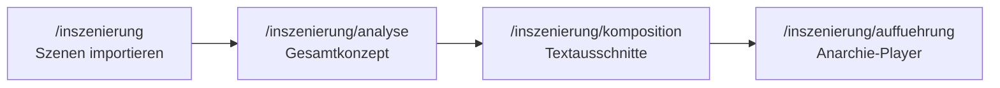

# Teil 2: Anarchische KI-Inszenierung

Separater Modus für **Elfriede Jelinek — *Unter Tieren***: mehrere Tier-Szenen zum Thema **Geld** importieren, von der KI analysieren und zu einer **anarchischen Live-Aufführung** komponieren.

Separater Modus für **Elfriede Jelinek — *Unter Tieren***: mehrere Tier-Szenen zum Thema **Geld** importieren (ohne Bärenklau), von Claude/ChatGPT analysieren und zu einer **anarchischen Live-Aufführung** komponieren.

**Teil 1** (`/dramaturgie`, `/auffuehrung`): **Gesamttext** (ca. 1–2 Seiten) — Claude/ChatGPT-Workshop mit begründeter Medienwahl (Zitate/Themen), Previews, finale Auswahl `6+6+6+1`, kontrollierte Aufführung (`anarchy_level` niedrig).

**Teil 2** startet separat über `/auffuehrung` (Orchestrator) oder `/inszenierung/auffuehrung`.

---

## Überblick



| Schritt | Route | Ergebnis |
|---------|-------|----------|
| 1. Korpus | `/inszenierung` | `SceneCorpus` mit N Tier-Szenen |
| 2. Analyse | `/inszenierung/analyse` | `Gesamtkonzept` (Geld-Achsen, Tiere, Anarchie-Kurve) |
| 3. Komposition | `/inszenierung/komposition` | `CompositionPlan` mit 8–20 Momenten, steigender Overlap |
| 4. Aufführung | `/inszenierung/auffuehrung` | Parallele Stimmen + gestapelte Video/Licht-Cues |

Persistenz: `data/inszenierungen/{id}.json` (parallel zu Teil-1-Produktionen unter `data/productions/`).

---

## Szenen importieren

### Einzelne Szene (Formular)

Auf `/inszenierung` nach Korpus-Erstellung:

- **Tier** — z. B. `Bär`, `Hund`
- **Szentitel** — optional, z. B. `Szene 20: Der Bärenklau`
- **Text** — Jelinek-Auszug (Tier spricht über Geld)

### Datei-Upload (empfohlen für mehrere Szenen)

**Dateien hochladen** — mehrere `.txt` oder `.json` Dateien wählen.

- **Eine Datei = eine Szene** (Standard)
- **Eine Datei, mehrere Szenen** — Blöcke mit `---` trennen

#### Textformat mit Kopfzeile

```text
Tier: Bär
Szene: Szene 20: Der Bärenklau

da wir also gar kein Geld haben, müssen wir uns dem Produzenten zuwenden …
```

Alternativ reicht der **Dateiname** als Tier: `Bär.txt`, `Hund_Szene3.txt` (Teil vor `_` = Tier).

#### Szentitel im Fließtext

```text
Szene 5: Im Stall

Der Text beginnt hier …
```

Die erste Zeile wird als Szentitel erkannt (wie in Teil 1).

#### Mehrere Szenen in einer Datei

```text
Tier: Bär
Szene: Szene 1
Erster Abschnitt …
---
Tier: Hund
Szene: Szene 2
Zweiter Abschnitt …
```

### Batch-Import (JSON)

**Batch-Import** bedeutet: **viele Szenen auf einmal** per JSON-Array (ohne Datei-Upload), z. B.:

```json
[
  {
    "animal": "Bär",
    "title": "Szene 20: Der Bärenklau",
    "source_text": "da wir also gar kein Geld haben …"
  },
  {
    "animal": "Hund",
    "title": "Szene 3",
    "source_text": "Der Hund rechnet mit dem Produzenten …"
  }
]
```

Oder als JSON-Datei mit Wrapper:

```json
{ "scenes": [ … ] }
```

API: `POST /api/v1/inszenierung/{id}/scenes/batch`  
Upload: `POST /api/v1/inszenierung/{id}/scenes/upload` (multipart, Feld `files`)

---

## Analyse-Workshop

Route: `/inszenierung/analyse`

- Liest **alle** Szenen des Korpus
- Zwei Dramaturgen (GPT + Claude) diskutieren auf **Korpusebene**
- Ergebnis: **Gesamtkonzept** mit Thesis, Geld-Themen, Tier-Positionen, Querverbindungen, Anarchie-Kurve (Start → Ende)

---

## Kompositions-Workshop

Route: `/inszenierung/komposition`

- Input: Gesamtkonzept + vollständiger Korpus + **Avatar-Textkatalog**
- KI wählt **konkrete Textausschnitte** (wörtlich aus den Szenen, validiert)
- Pro Moment: `speech_mode` — `avatar_video` (gesprochen im Pixera-Clip), `tts` (KI-Stimme), oder `silent`
- Reihenfolge mit steigendem `anarchy_level` und `overlap_with_previous`
- Frühe Momente: bevorzugt Avatar-Videos; später Wechsel Avatar ↔ KI-TTS, parallele Layer
- Pro Moment: Regie (`dramaturgy`) mit Video-, Sound-, Licht-Cues

Unterschied zu Teil 1: nicht der ganze Beat, sondern **explizit gewählte Ausschnitte** in nicht-linearer Reihenfolge.

---

## Stimmen-Matrix

| Rolle | Speaker-ID | macOS (Default) |
|-------|------------|-----------------|
| Dramaturg A (GPT) | `openai` | Petra (Premium) |
| Dramaturg B (Claude) | `anthropic` | Viktor (Enhanced) |
| Aufführung Teil 1 | `AI_A`, `AI_B`, `narrator` | Anna, Martin, Alex |
| KI-TTS Teil 2 | `AI_A`, `AI_B`, `narrator` | Eddy, Sandy, Helena |
| Avatar-Sprache | — | kein TTS (Text im Video) |

Konfiguration in `backend/.env` — siehe `TTS_VOICE_*` und `TTS_VOICE_INSZENIERUNG_*`. TTS-API akzeptiert optional `profile`: `dramaturg` | `performance` | `inszenierung`.

---

## Avatar-Textkatalog

Quelle: [`media/video/Avatar Textzuordnung.csv`](../media/video/Avatar%20Textzuordnung.csv) (aus Excel-Übersicht Del/Wolf)

| Prefix | Figur | Default Pixera-Clip |
|--------|-------|---------------------|
| DEL | Delphin | `avatar` |
| BK | Bärenklau | `avatar2` |
| LG | Lamm Gottes | `esel` |
| PET | Petya | `hundethiel` |
| WO | Wolf | `thiel` |

API: `GET /api/v1/media/avatar-speech` — Cache: `data/avatar_speech.json` (via `make avatar-catalog`).

Die KI matcht Jelinek-Ausschnitte an Avatar-Texte (`avatar_speech_id` z. B. `BK3`) und wählt den passenden Clip.

---

## Aufführung (Anarchie)

Route: `/inszenierung/auffuehrung`

1. **TTS-Puffer** — nur Momente mit `speech_mode: tts` werden vorab vertont (Profil `inszenierung`)
2. **Play** wenn Puffer fertig (oder nur Avatar-Momente ohne TTS)
3. **AnarchyPlayback**:
   - `avatar_video`: Pixera-Clip feuert, Wartezeit `duration_hint_ms`, kein TTS
   - `tts`: bis zu 3 parallele KI-Stimmen
   - Video-Cues auf mehreren Projektoren (`layer`-Modus)
   - Licht: neuer Cue ersetzt den vorherigen (`/eos/key/out`, dann neue Kanäle)
   - **kein** Neutral-Reset zwischen Momenten — Anarchie steigt bis zum Ende

---

## Medien für die Regie

Teil 2 nutzt dieselben Kataloge wie Teil 1:

| Medium | Quelle |
|--------|--------|
| Video | `media/video/Video Übersicht.csv` + OSC-Liste |
| Sound | `media/sound/Sound Übersicht.csv` (inkl. `leere_zwischen_saetzen`) |
| Licht | `data/light_scenes.json` (Lichtstimmungen, siehe `media/light/Lichtstimmungen.txt`) |

---

## Unterschied Teil 1 vs. Teil 2

| | Teil 1 | Teil 2 |
|---|--------|--------|
| Text | Ein Stücktext, Beats | Mehrere Szenen (Korpus) |
| Dramaturgie | Pro Beat, sequentiell | Meta-Analyse + Komposition |
| Wiedergabe | Diskussion → Reset → Stücktext | Eskalierende Überlagerung |
| Stimmen | Eine Spur nacheinander | Multi-Voice + Avatar-Video + KI-TTS |
| Video | Ein Clip ersetzt den anderen | Mehrere Projektoren parallel |
| Licht | Szenen nacheinander | Ersetzen (Key Out) + Kombination möglich |

---

## Schnellstart

```bash
make run
# Browser: http://localhost:3003/inszenierung
```

1. Korpus anlegen  
2. 2–5 Szenen per **Datei-Upload** oder Formular importieren  
3. **Analyse** starten → Gesamtkonzept prüfen  
4. **Komposition** starten → Momente reviewen  
5. **Aufführung** → TTS-Puffer abwarten → Play  

---

## Tests

```bash
cd backend
.venv/bin/python -m pytest tests/test_inszenierung_import.py tests/test_inszenierung_validation.py tests/test_voice_map.py tests/test_avatar_speech_catalog.py tests/test_inszenierung_komposition.py -q
cd ../frontend && npm test -- anarchyPlayback.test.ts --run
```

---

## Copyright

Nur **eigene Auszüge** aus *Unter Tieren* importieren — kein Volltext im Repository.
