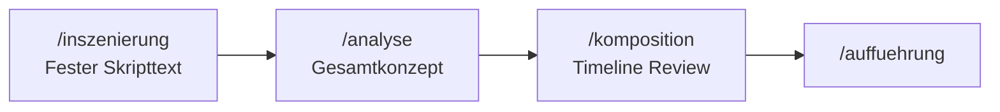

# Teil 2: Skriptgesteuerte Avatar-Inszenierung

Separater Modus für **Elfriede Jelinek — *Unter Tieren***: fester Avatar-Skriptablauf «AVATAR Text Delfin bis Wolf», Avatar-Sprache aus CSV, parallel eskalierende OSC für Sound, Video und Licht.

**Teil 1** (`/dramaturgie`, `/auffuehrung`): Ein Stücktext, sequentielle Aufführung.

**Teil 2** startet über `/inszenierung` → Analyse → Komposition → `/inszenierung/auffuehrung`.

---

## Überblick



| Schritt | Route | Ergebnis |
|---------|-------|----------|
| 1. Korpus | `/inszenierung` | `SceneCorpus` mit festem Skripttext |
| 2. Analyse | `/inszenierung/analyse` | `Gesamtkonzept` + Anarchie-Kurve |
| 3. Komposition | `/inszenierung/komposition` | Deterministische Timeline aus CSV |
| 4. Aufführung | `/inszenierung/auffuehrung` | Avatar-Video + gestapelte OSC-Cues |

Persistenz: `data/inszenierungen/{id}.json`

---

## Skriptquellen

| Datei | Rolle |
|-------|-------|
| `Stücktext/AVATAR Text Delfin bis Wolf.txt` | Kanonischer Textablauf (aus Pages exportiert) |
| `Stücktext/AVATAR Text Delfin bis Wolf.pages` | Referenz im Repo |
| `media/video/Avatar Textzuordnung.csv` | Avatar → Text → Pixera-Clip, **Aufführungsreihenfolge** (exportiert aus `Textzuordnung Del-Wolf-27-06-26.numbers`) |
| `media/video/OSCBefehllisteAvatare.txt` | Pixera OSC — Avatar-Clips (Teil 2) |
| `media/video/OSCBefehllisteOhneAvatare.txt` | Pixera OSC — Atmosphären-Clips |

### Numbers-Export

Quelle: `media/video/Textzuordnung Del-Wolf-27-06-26.numbers`

```bash
make avatar-import   # nach Änderung an der Numbers-Datei
```

Erzeugt/aktualisiert:
- `Avatar Textzuordnung.csv`
- `Video Übersicht.csv` (Clips aus OSC-Listen)
- `Stücktext/AVATAR Text Delfin bis Wolf.txt`

Alternativ weiterhin manueller Pages-Export für den Skripttext möglich.

API: `GET /api/v1/inszenierung/script` — Skripttext + Beat-Vorschau

---

## Avatar-Timeline (CSV)

CSV-Spalten: `id;text;avatar;video_clip_id;scene_ref`

| Prefix | Figur | Default Pixera-Clip |
|--------|-------|---------------------|
| DEL | Delphin | `avatar` |
| BK | Bärenklau | `avatar2` |
| LG | Lamm Gottes | `esel` |
| PET | Petya | `hundethiel` |
| WO | Wolf | `thiel` |

### Chorus-Regel

Aufeinanderfolgende CSV-Zeilen mit **gleichem `text`** → ein Beat, mehrere Avatare sprechen gleichzeitig, je eigener Beamer.

### Beamer-Verteilung

| Avatar | Standard-Beamer (früh) |
|--------|------------------------|
| delphin | rz21 |
| baerenklau | rz21 |
| lamm | adam |
| petya | eva |
| wolf | led |

- **Anarchie &lt; 0.5:** ein Beamer pro Avatar (`projector_mode: single`)
- **Anarchie ≥ 0.5:** gleicher Clip auf **alle** Beamer (`rz21`, `adam`, `eva`, `led`)
- Steigende Anarchie: Video `replace` → `layer`, mehr parallele Sound/Licht-Cues

---

## Analyse-Workshop

Route: `/inszenierung/analyse`

- Input: fester Skripttext (nicht mehr manuell importierte Szenen)
- Zwei Dramaturgen diskutieren den Avatar-Ablauf
- Ergebnis: `Gesamtkonzept` mit `anarchy_curve` (Start → Ende)

---

## Komposition

Route: `/inszenierung/komposition`

- **Kein KI-Ausschnittswahl** mehr — deterministisch aus CSV
- Button: **Timeline aus Skript laden** (`POST /api/v1/inszenierung/{id}/compose-script`)
- Pro Beat: `avatar_video`, Beamer-Zuweisung, Rule-Engine-Dramaturgie für OSC

---

## Aufführung

Teil 2 ist über **zwei Wege** abspielbar:

| Route | Nutzung |
|-------|---------|
| `/auffuehrung?corpus={id}` | Nur Teil 2 (eigenständig) |
| `/auffuehrung?id={script}&corpus={id}` | Teil 1 + Teil 2 im selben Stück |
| `/inszenierung/auffuehrung?id={id}` | Dedizierte Teil-2-Ansicht |

### Export / Import

- **Export:** `POST /api/v1/inszenierung/{corpus_id}/export` → `.tmteil2.zip` (Korpus + Timeline + Analyse)
- **Import:** `POST /api/v1/inszenierung/import` → neuer Korpus mit frischer ID
- In `/auffuehrung`: Buttons «Teil 2 importieren» / «Teil 2 exportieren»

### Playback

1. Timeline wird beim Laden automatisch aus dem Skript erzeugt, falls noch keine Komposition existiert
2. **Play** — bei reinen Avatar-Beats kein TTS-Puffer nötig
3. **AnarchyPlayback** (Avatar + Anarchie **parallel** pro Beat):
   - Avatar-Clips auf zugewiesenen Beamern (Chorus parallel)
   - Sound/Video/Licht aus `dramaturgy` gleichzeitig
   - Anarchie steigt bis Kollaps am Ende

---

## Aufführung (Inszenierung-Route)

Route: `/inszenierung/auffuehrung` — gleiche Engine, schlanke UI

---

## Schnellstart

```bash
make run
# Browser: http://localhost:3003/inszenierung
```

1. Korpus anlegen (lädt Skripttext automatisch)
2. **Analyse** → Gesamtkonzept prüfen
3. **Komposition** → Timeline aus Skript laden
4. **Aufführung** → Play

---

## Tests

```bash
cd backend
.venv/bin/python -m pytest tests/test_teil2_script_service.py tests/test_teil2_projector_assignment.py tests/test_teil2_compose_script.py tests/test_inszenierung_bundle_service.py tests/test_avatar_speech_catalog.py -q
cd ../frontend && npm test -- anarchyPlayback.test.ts --run
```

---

## Copyright

Nur **eigene Auszüge** aus *Unter Tieren* — kein Volltext im Repository.
